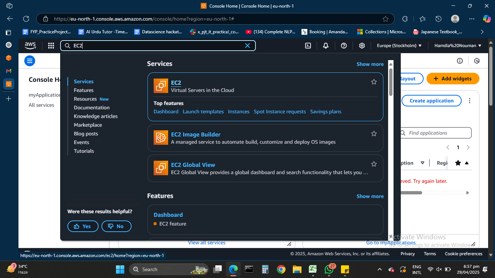
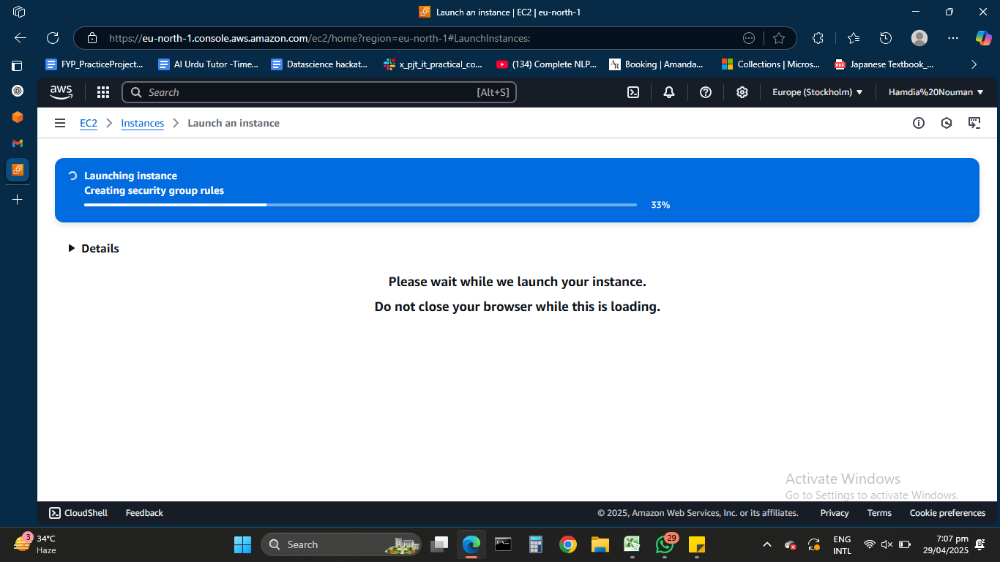
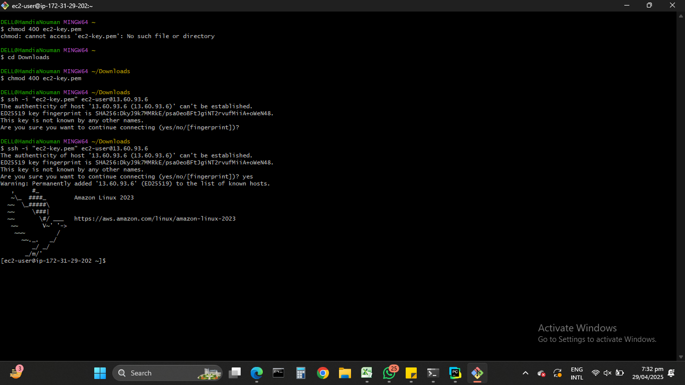

# 🖥️ EC2 Instance Setup on AWS

---

## ✅ Step 1: Login to AWS Console

1. Visit [https://aws.amazon.com/](https://aws.amazon.com/)
2. Click **Sign in to the Console**
3. Navigate to **EC2** from the Services menu



---

## 🚀 Step 2: Launch EC2 Instance

1. Click **Launch Instance**
2. **Instance Name:** `IT_Lec_3`
3. **Amazon Machine Image (AMI):** Amazon Linux 2023 
4. **Instance Type:** `t3.micro`
5. **Key Pair:** Create new key pair (Download `ec2-key.pem`)
6. **Security Group:** Allow SSH (port 22)
7. Click **Launch Instance**

📸 _Screenshot of instance configuration:_



---

## 🔐 Step 3: Connect to Your EC2 Instance via SSH

After the instance is running:

1. Go to **EC2 Dashboard → Instances**
2. Select your instance → Click **Connect**
3. Choose the **SSH client** tab and follow the given instructions.

### Sample SSH command:
```bash
chmod 400 my-key.pem
ssh -i "ec2-key.pem" ec2-user@13.60.93.6

